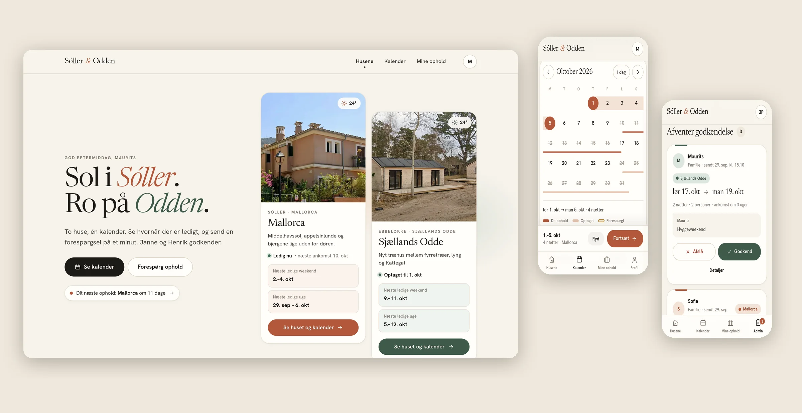

# Sóller & Odden · Familiens ferieboliger

Familiens private booking-side for Janne og Henriks to huse:

- **Mallorca**: Carrer d'Adela Olivér Llinás 27, Sóller
- **Sjællands Odde**: Hyldebærstien 5, Ebbeløkke, 4500 Nykøbing Sj.

Familien ser ledige perioder og sender forespørgsler. Janne og Henrik godkender eller afviser med ét tryk. Venner kan låne husene via personlige gæstelinks. Siden virker på mobil og computer og kan lægges på hjemmeskærmen som en app.



> **Estimated recurring cost: 0 DKK/month**
>
> Frontend på GitHub Pages (gratis for offentlige repos), data og login i Supabase Free (intet betalingskort). Ingen server, ingen betalte API'er, ingen mailservice.

---

## Indhold

1. [Arkitektur](#arkitektur)
2. [Hvorfor den er gratis, og hvad den afhænger af](#pris-0-kr-om-måneden)
3. [Opsætning trin for trin](#opsætning-ca-15-minutter)
4. [Janne og Henrik som administratorer](#janne-og-henrik-som-administratorer)
5. [Nye familiemedlemmer, gæster og glemte adgangskoder](#familie-gæster-og-adgangskoder)
6. [Billeder og tekster](#billeder-og-tekster)
7. [Backup](#backup)
8. [Når Supabase sætter projektet på pause](#pause-supabase-free)
9. [Lokal udvikling og tests](#lokal-udvikling-og-tests)
10. [Sikkerhed og privatliv](#sikkerhed-og-privatliv)
11. [Datamodel og datoer](#datamodel-og-datoer)
12. [Designvalg](#designvalg)
13. [Vedligehold](#vedligehold)
14. [Fejlfinding](#fejlfinding)

---

## Arkitektur

```
 Mobil / computer
 ┌────────────────────────────────────────────┐
 │  Statisk app: HTML + CSS + vanilla JS      │  ← GitHub Pages (https://…github.io/ferieboliger)
 │  Ingen build, ingen npm i produktion       │
 │  supabase-js 2.117.2 ligger i vendor/      │
 └──────────────┬─────────────────────────────┘
                │ HTTPS (publishable key + brugerens login-token)
 ┌──────────────▼─────────────────────────────┐
 │  Supabase Free                             │
 │   • Auth: email + adgangskode              │
 │     (kun via invitationslink)              │
 │   • Postgres: tabeller, RLS, constraints   │
 │   • Alle regler i SQL-funktioner (RPC)     │  ← supabase/setup.sql
 └────────────────────────────────────────────┘
   Valgfrit:  Open-Meteo (vejr, ingen nøgle) · GitHub Actions (ping hver 3. dag)
```

- **Ingen egen backend.** Al forretningslogik (hvem må hvad, datovalidering, overlap) ligger i Postgres-funktioner, så den kan ikke omgås fra browseren.
- **Ingen framework og ingen build-pipeline.** ES-moduler direkte i browseren. Man kan ændre en fil, pushe, og GitHub Pages serverer den.
- **Hash-routing** (`#/kalender`) virker på GitHub Pages uden serveropsætning, og tokens i links (`#/invitation/…`) sendes aldrig til en server.

## Pris: 0 kr. om måneden

| Tjeneste | Hvad den bruges til | Gratisgrænse | Familiens forbrug |
|---|---|---|---|
| GitHub Pages | Hosting af siden | Gratis for offentlige repos, 100 GB trafik/md | Få MB/md |
| Supabase Free | Database, login, sikkerhed | 500 MB database, 50.000 aktive brugere/md, 5 GB trafik/md, 2 gratis projekter | Under 1 MB data, ~10 brugere |
| GitHub Actions | Valgfri keepalive-ping | Gratis for offentlige repos | ~10 sekunder hver 3. dag |
| Open-Meteo | Vejrudsigt | Gratis til ikke-kommerciel brug, ingen nøgle | Få kald pr. besøg (caches 30 min) |

Der er **ingen** betalte tjenester, ingen SMS, ingen mailservice og intet betalingskort. Hvis en gratisgrænse mod forventning blev ramt, stopper tjenesten med at svare. Den begynder ikke at koste penge, fordi der ikke er et kort tilknyttet.

Grænserne er tjekket i september 2026. Supabase og GitHub kan ændre dem, men en familiebooking ligger flere størrelsesordener under.

---

## Opsætning (ca. 15 minutter)

Du skal bruge en GitHub-konto og en gratis Supabase-konto. Menupunkterne i Supabase skifter navn en gang imellem; teksterne herunder passer pr. september 2026.

### 1. Opret Supabase-projektet

1. Gå til [supabase.com](https://supabase.com), log ind med GitHub, og tryk **New project**.
2. Vælg **Free**-planen, giv projektet et navn (fx `ferieboliger`), vælg en region i EU (fx Frankfurt eller Stockholm), og gem databaseadgangskoden i din password manager.

### 2. Kør databasescriptet

1. Åbn **SQL Editor** → **New query**.
2. Indsæt hele indholdet af [`supabase/setup.sql`](supabase/setup.sql), og tryk **Run**.
3. Det opretter tabeller, constraints, indexes, RLS-policies, funktioner og de to boliger. Scriptet kan køres igen senere (fx efter en opdatering) uden at slette data.

### 3. Indstil login

Under **Authentication → Sign In / Providers**:

| Indstilling | Værdi | Hvorfor |
|---|---|---|
| Email provider | **Slået til** | Login med email og adgangskode |
| **Confirm email** | **Slået fra** | Supabases gratis mail sender kun til projektets egne medlemmer. Invitationslinket er beviset, så der er ikke brug for bekræftelsesmails. |
| Allow new users to sign up | **Slået til** | Påkrævet for at invitationer kan oprettes. Databasen afviser alle, der ikke har et gyldigt invitationslink (trigger på `auth.users`). |
| Minimum password length | 8 | Samme krav som appen |

Anonymous sign-ins og alle sociale logins (Google, Apple …) skal være **slået fra** (det er standard).

### 4. Forbind siden

1. Åbn **Project Settings → API Keys**.
2. Kopiér **Project URL** og **Publishable key** (`sb_publishable_…`).
3. Sæt dem ind i [`config.js`](config.js):

```js
export default {
  supabaseUrl: 'https://abcdefghijkl.supabase.co',
  supabaseKey: 'sb_publishable_xxxxxxxxxxxxxxxxxxxx',
  …
};
```

Den publishable key må gerne være offentlig: den giver kun de rettigheder, RLS og funktionerne tillader. **Læg aldrig** en `secret`- eller `service_role`-nøgle i repoet.

### 5. Udgiv på GitHub Pages

1. Commit og push til `main` i repoet `maurits2905/ferieboliger`.
2. På GitHub: **Settings → Pages → Build and deployment → Source: Deploy from a branch**, vælg `main` og `/ (root)`, og gem.
3. Efter et minut ligger siden på `https://maurits2905.github.io/ferieboliger/`.

Hedder repoet noget andet, så ret også `og:image` i `index.html` og linket i `supabase/first-admins.sql`.

### 6. Opret de første konti

1. Ret navne og emails i [`supabase/first-admins.sql`](supabase/first-admins.sql), og kør den i SQL Editor.
2. Resultatet viser et link pr. person. Send dem til Janne, Henrik og dig selv.
3. Hver person åbner sit link, vælger en adgangskode og er logget ind.

### 7. (Valgfrit) Demo-data

Kør [`supabase/demo-data.sql`](supabase/demo-data.sql) for at få nogle ophold i kalenderen, mens I prøver systemet af. Fjern dem igen med `delete from public.bookings where source = 'demo';`.

### 8. (Valgfrit) Keepalive

Workflowet [`.github/workflows/keepalive.yml`](.github/workflows/keepalive.yml) pinger databasen hver 3. dag, så Supabase ikke sætter projektet på pause. Det læser URL og nøgle fra `config.js` og kræver ingen opsætning. Se [Pause](#pause-supabase-free).

---

## Janne og Henrik som administratorer

En administrator kan alt: se alle detaljer, godkende og afvise, oprette, rette, annullere og slette ophold, blokere perioder, skrive interne noter, invitere familie og rette oplysningerne om husene.

- **Via invitation (anbefalet):** lav invitationen med rollen `admin` (se trin 6), eller i appen under **Administration → Familie → Inviter → Administrator**.
- **Gør en eksisterende konto til admin:** i appen under **Administration → Familie → personen → Rolle**, eller i SQL Editor:

  ```sql
  update public.profiles set role = 'admin' where email = 'henrik@example.com';
  ```

Der skal altid være mindst én aktiv administrator. Databasen forhindrer, at den sidste fjernes, og at en admin fjerner sin egen adgang.

**Kort guide til Janne og Henrik:**

- Tallet på **Admin** viser, hvor mange forespørgsler der venter. Tryk **Godkend** eller **Afslå**, og skriv evt. en besked.
- Efter en godkendelse kan I trykke **Giv besked** og sende en færdigskrevet SMS eller besked.
- **Opret ophold**, **Egen ferie** og **Bloker periode** ligger øverst i Administration. Det, I selv opretter, er godkendt med det samme.
- I kalenderen kan I trykke på et ophold for at se detaljer, historik og interne noter.

## Familie, gæster og adgangskoder

**Nyt familiemedlem:** Administration → Familie → **Inviter**. Skriv navn og email. I får et link, som I selv sender (SMS, Messenger, mail). Linket virker i 30 dage og kan bruges én gang. Ingen kan oprette en konto uden et link.

**Venner og gæster:** Et familiemedlem laver et gæstelink under **Mine ophold → Gæstelinks** (fx "Peter og Anne"). Gæsten åbner linket uden at logge ind, ser ledige datoer (kun "Optaget"/"Forespurgt", aldrig navne) og sender en forespørgsel med navn og email. Gæsten får et statuslink, hvor svaret, adressen, praktisk info og Wi-Fi vises, når opholdet er godkendt. Et gæstelink kan bruges til 3 forespørgsler og udløber efter valgfri periode. Administratorer kan se og lukke alle gæstelinks.

**Glemt adgangskode:** Administration → Familie → personen → **Lav nulstillingslink**. Personen åbner linket og vælger en ny adgangskode. Man kan også selv skifte adgangskode under **Profil**, når man er logget ind.

Hvis nulstillingslinket en dag ikke virker (fordi Supabase ændrer rettighederne på `auth.users`), kan du sætte en ny adgangskode i SQL Editor:

```sql
update auth.users
set encrypted_password = extensions.crypt('ny-midlertidig-kode', extensions.gen_salt('bf'))
where email = 'person@example.com';
```

**Fjern adgang:** Administration → Familie → personen → slå **Aktiv** fra. Historikken bevares. Skal kontoen slettes helt, gøres det i Supabase under Authentication → Users.

## Billeder og tekster

**Tekster** (beskrivelse, adresse, check-in/-ud, husregler, kontakt, Wi-Fi og adgang) rettes i appen under **Administration → Boliger**. Wi-Fi og adgangsoplysninger vises kun for personer med et godkendt, kommende eller igangværende ophold.

**Billeder** ligger i repoet:

| Fil | Bruges til |
|---|---|
| `assets/photos/*-original.webp` | Originalerne |
| `assets/img/<id>.webp`, `<id>-sm.webp` | Brede billeder og thumbnails |
| `assets/img/<id>-portrait.webp` | Kortene på forsiden |
| `assets/img/og.jpg` | Forhåndsvisning, når linket deles |

Sådan skifter du et billede:

1. Læg det nye foto i `assets/photos/` (fx `odde-original.jpg`, gerne 2000 px bredt eller mere).
2. Ret filnavn og beskæring i `dev/make-images.py`.
3. Kør `pip install pillow && python3 dev/make-images.py`, og commit.

Alternativt kan du bare erstatte `.webp`-filerne med nye filer med samme navn. De nuværende billeder er Street View-udsnit i lav opløsning, så rigtige fotos vil løfte siden mærkbart.

Farver og billedvalg pr. hus ligger i `js/properties.js` og `css/base.css` (`--mallorca`, `--odde`).

## Backup

- **I appen:** Administration → Boliger → **Download backup (JSON)**. Filen indeholder alle ophold, noter, historik, familie og boligernes oplysninger. Tag en backup et par gange om året, og gem den et sikkert sted (den indeholder Wi-Fi-koder).
- **Fuld databasebackup:** Hent forbindelsesstrengen under **Connect → Session pooler**, og kør `pg_dump "postgresql://…" --schema=public --schema=auth > backup.sql`.

Stol ikke på Supabases egne backups på gratisplanen; download selv.

## Pause (Supabase Free)

Supabase sætter gratisprojekter på pause efter **7 dage uden databaseaktivitet**.

**Hvad familien oplever:** Siden åbner fint (den ligger på GitHub), men data kan ikke hentes. Appen viser "Ingen forbindelse … databasen kan være sat på pause". Intet data går tabt.

**Sådan vækkes den:** Log ind på supabase.com, åbn projektet, og tryk **Restore project**. Det tager et par minutter. Supabase sender også en mail til projektets ejer, før og når projektet pauses. Et projekt, der har været på pause i lang tid, kan ikke nødvendigvis gendannes med ét klik, så lad det ikke ligge i måneder.

**Sådan undgås det:** `keepalive.yml` pinger databasen hver 3. dag via GitHub Actions. GitHub slår planlagte workflows fra efter 60 dage uden commits i et offentligt repo; workflowet forsøger at nulstille det selv. Får du en mail om, at workflowet er slået fra, så gå til **Actions → Hold databasen vågen → Enable workflow**. Du kan også starte det manuelt med **Run workflow**.

## Lokal udvikling og tests

**Frontend mod det rigtige projekt:** Siden er statiske filer.

```bash
python3 -m http.server 8080   # åbn http://localhost:8080
```

Bemærk at det rammer de rigtige data.

**Helt lokalt med en emulator** (valgfrit, kræver Postgres 15+ og Node 20+). `dev/local-supabase.mjs` er en lille stand-in for Supabase (email-login og RPC), som kører den rigtige `setup.sql` mod en lokal Postgres:

```bash
export PGHOST=localhost PGUSER=postgres       # din lokale Postgres
cd dev && npm install
./reset-local-db.sh                            # opretter ferieboliger_dev med demo-data
node local-supabase.mjs                        # http://localhost:8787
```

Demo-logins: `janne@familien.dk` (admin), `maurits@familien.dk` (familie), kode `ferie2026`. Gæstelink: `http://localhost:8787/#/gaest/local-guest-link-peter-000`.

**Sikkerhedstests for databasen:** `./dev/run-sql-tests.sh` kører `setup.sql` to gange mod en tom database og derefter `dev/test.sql`, som prøver at bryde reglerne som anonym, familiemedlem, gæst og admin (rolleeskalering, andres data, overlap, udløbne links m.m.). Kør den efter ændringer i SQL'en.

## Sikkerhed og privatliv

Sikkerheden ligger i databasen, ikke i browseren.

- **Row Level Security** er slået til på alle tabeller. Klienter kan kun læse egne rækker (admins alt), og ingen klient har INSERT/UPDATE/DELETE-rettigheder på tabellerne.
- **Alle ændringer går gennem SQL-funktioner** (`security definer`, fast `search_path`), der tjekker rolle, ejerskab, datoer, kapacitet og status. Supabases standard-EXECUTE-rettigheder fjernes, og hver funktion åbnes kun for den rolle, der skal bruge den.
- **Ingen kan gøre sig selv til admin.** Rollen ligger i `profiles` og sættes kun ud fra invitationen eller af en admin. Metadata fra browseren ignoreres.
- **Invite-only:** en trigger på `auth.users` afviser enhver ny konto uden et gyldigt, ubrugt invitationslink til præcis den email.
- **Dobbeltbooking er umulig** i databasen: en `EXCLUDE USING gist`-constraint forbyder to godkendte ophold i samme hus samme nat, også ved samtidige godkendelser (testet med to parallelle transaktioner).
- **Privatliv:** familiemedlemmer ser andres ophold som "Optaget" eller "Forespurgt" uden navne, antal eller type. Gæster ser kun det samme for det hus, deres link gælder. Interne noter, gæsters kontaktinfo og historik er kun for admins. Wi-Fi og adgangskoder vises kun med et godkendt ophold.
- **Tokens** i invitations-, nulstillings-, gæste- og statuslinks er 144-bit tilfældige værdier, står efter `#` i URL'en (sendes ikke til servere) og udløber.
- **Ingen hemmeligheder i repoet.** Kun den publishable key ligger i `config.js`. Siden har `noindex`, så søgemaskiner ikke viser den.
- **Offentligt repo:** GitHub Pages kræver et offentligt repo på gratisplanen. Koden og husenes adresser (i `setup.sql`) er derfor synlige; kalender, navne, telefonnumre og Wi-Fi ligger kun i databasen. Vil du ikke have adresserne i repoet, så slet dem fra `setup.sql` efter første kørsel og vedligehold dem i appen.

Supabases **Security Advisor** kan advare om, at `security definer`-funktioner kan kaldes via API'et. Det er med vilje: de er appens API og tjekker selv rettigheder.

## Datamodel og datoer

| Tabel | Indhold |
|---|---|
| `profiles` | Én række pr. konto: navn, email, telefon, rolle (`admin`/`member`), aktiv |
| `invitations` | Invitationslinks (token, email, navn, rolle, udløb, brugt) |
| `password_resets` | Nulstillingslinks |
| `properties` | Husene: tekster, adresse, tider, husregler, kontakt, koordinater |
| `property_access` | Wi-Fi og adgangsinfo (følsomt, separat tabel) |
| `guest_links` | Gæstelinks lavet af familien |
| `bookings` | Alle ophold og forespørgsler |
| `booking_notes` | Interne noter (kun admin) |
| `booking_events` | Historik: hvem gjorde hvad hvornår (skrives af en trigger) |

**Ophold (`bookings`):**

- `kind`: `stay` (familie eller gæst), `owner` (Janne og Henriks egen ferie), `blocked` (lukket periode)
- `status`: `pending` → `approved` / `rejected`, eller `cancelled`
- `source`: `member`, `admin`, `guest` eller `demo`

**Datoer:** `start_date` er ankomstdagen, `end_date` er afrejsedagen. Et ophold dækker nætterne fra og med ankomst til (men ikke med) afrejse, altså intervallet `[start_date, end_date)`. Derfor kan afrejsedagen være næste gæsts ankomstdag: 1.–7. juli og 7.–14. juli overlapper ikke. Kalenderen tegner ophold fra midten af ankomstdagen til midten af afrejsedagen, så skiftedagen er tydelig. Datoer er rene kalenderdatoer uden tidszone; "i dag" beregnes i dansk tid.

Regler i databasen: afrejse efter ankomst, højst 60 nætter pr. forespørgsel (120 for admins), ingen ankomst i fortiden for familie og gæster, højst to år frem, antal personer mellem 1 og husets max, højst 5 åbne forespørgsler pr. person.

## Designvalg

- **Email og adgangskode frem for magic links.** Magic links kræver en mailservice. Supabases indbyggede mail sender kun til projektets egne medlemmer og kun et par mails i timen, så det ville kræve en ekstern SMTP-konto (fx Gmail-app-kode eller Brevo). Det er en ekstra afhængighed, der kan gå i stykker. Invitationslinks sendes i stedet via de kanaler, familien allerede bruger, og man forbliver logget ind på sin enhed.
- **Ingen email-notifikationer i denne version**, af samme grund. I stedet: tallet på Admin-fanen, "Giv besked"-knapper med færdigskrevne beskeder (SMS/Messenger/mail via telefonens deling), og en statusside for gæster. Skal der mails på senere, er den gratis vej en Supabase Edge Function + Brevo eller Gmail SMTP.
- **Gæstelinks i stedet for en offentlig formular.** En offentlig formular ville vise, hvornår husene står tomme, og invitere til spam. Et link fra en i familien er sikrere og giver samtidig svaret på "hvem kender I?".
- **Vejr fra Open-Meteo** (ingen nøgle). Fejler tjenesten, vises vejret bare ikke.
- **PWA:** kan installeres på hjemmeskærmen og åbner uden netværk (app-skallen caches, data gør ikke).

## Vedligehold

Der er ingen servere, certifikater eller processer at holde kørende.

- `vendor/supabase.js` er en fastlåst kopi (2.117.2). Den behøver ikke opdateres. Vil du opdatere: `npm pack @supabase/supabase-js@<version>` og kopiér `dist/umd/supabase.js`.
- Supabase udfaser de gamle `anon`-nøgler; siden bruger den nye publishable key.
- Skrifterne (Newsreader og Hanken Grotesk, SIL Open Font License) ligger lokalt i `assets/fonts/`, så der er ingen afhængighed af Google Fonts.
- Ændringer i `supabase/setup.sql` køres ved at køre hele filen igen i SQL Editor.

## Fejlfinding

| Problem | Løsning |
|---|---|
| Siden siger "Forbind siden til Supabase" | `config.js` mangler URL eller nøgle |
| "Databasen er ikke sat op endnu" | Kør `supabase/setup.sql` |
| "Ingen forbindelse" for alle | Projektet er sat på pause: Restore project på supabase.com |
| "Kontoen er oprettet, men Supabase kræver email-bekræftelse" | Slå **Confirm email** fra (trin 3) |
| "Invitationen kunne ikke bruges" | Linket er brugt eller udløbet. Lav en ny invitation |
| "Oprettelse af konti er slået fra" | Slå **Allow new users to sign up** til (trin 3) |
| En person kan ikke logge ind | Lav et nulstillingslink under Familie |
| En ny version vises ikke | Genindlæs siden; service workeren henter altid nyeste version først |

## Filstruktur

```
index.html              App-skal
config.js               Supabase URL + publishable key + navne
manifest.webmanifest    PWA
sw.js                   Service worker (network first)
css/                    base, components, calendar, pages
js/
  main.js               Opstart, routing, adgangskontrol
  api.js                Al kommunikation med Supabase (kun RPC)
  calendar.js           Kalenderkomponenten
  booking-form.js       Forespørgsel / booking / redigering
  booking-detail.js     Admin: detaljer, godkend, noter, historik
  views/                Sider: forside, bolig, kalender, mine, admin, login, gæst, profil
supabase/
  setup.sql             Hele databasen (kan køres igen)
  first-admins.sql      De første invitationer
  demo-data.sql         Valgfri demo-ophold
dev/                    Lokal emulator, SQL-tests, billedscript (bruges ikke i produktion)
assets/                 Billeder, ikoner, skrifter
.github/workflows/      Keepalive-ping
```
